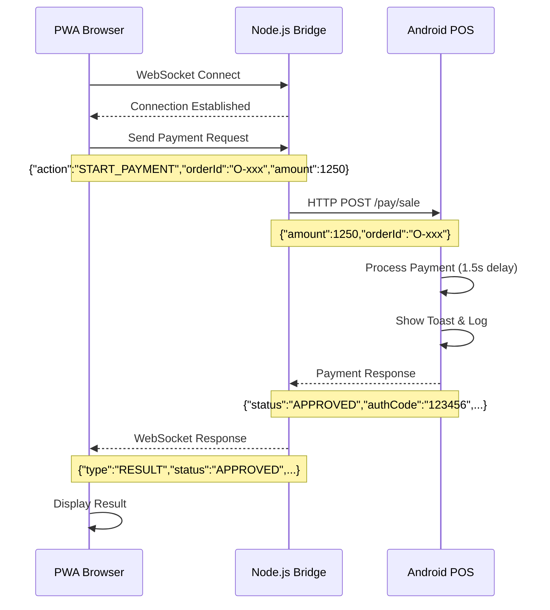

# Technical Report - POS Payment System (PWA & Android)

## Table of Contents
1. [Overall System Architecture](#overall-system-architecture)
2. [Current Process - Android Side](#current-process---android-side)
3. [Current Process - PWA Side](#current-process---pwa-side)
4. [Technical Diagrams](#technical-diagrams)
5. [Data Flow](#data-flow)
6. [Implementation Details](#implementation-details)

---

## Overall System Architecture

### Current Architecture Diagram
```
┌─────────────────┐    WebSocket     ┌─────────────────┐    HTTP Request    ┌─────────────────┐
│                 │ ◄──────────────► │                 │ ◄─────────────────► │                 │
│   PWA Browser   │                  │  Node.js Bridge │                    │  Android POS    │
│                 │                  │                 │                    │                 │
│  - WebSocket    │                  │  - WebSocket    │                    │  - Ktor Server  │
│    Client       │                  │    Server       │                    │  - HTTP Server  │
│  - UI/UX        │                  │  - HTTP Client  │                    │  - Payment API  │
│  - Payment UI   │                  │  - Bridge Logic │                    │  - Toast/Logs   │
└─────────────────┘                  └─────────────────┘                    └─────────────────┘
```

### Ports and Protocols
- **PWA**: `https://localhost:6743` (HTTPS/WebSocket)
- **Bridge**: `https://localhost:6743` (WebSocket Server) + HTTP Client
- **Android**: `http://192.168.224.10:8080` (HTTP Server)

---

## Current Process - Android Side

### 1. Ktor Server Setup
```kotlin
// MainActivity.kt - Server startup
private suspend fun startServer() = withContext(Dispatchers.IO) {
    server = embeddedServer(CIO, host = "0.0.0.0", port = 8080) {
        install(ContentNegotiation) { jackson() }
        install(CallLogging)
        install(WebSockets) {
            pingPeriod = Duration.ofSeconds(15)
            timeout = Duration.ofSeconds(30)
        }
        
        routing {
            // Endpoints...
        }
    }.start(wait = false)
}
```

### 2. Available Endpoints
| Endpoint | Method | Description |
|----------|--------|-------------|
| `/health` | GET | Server status check |
| `/pay/sale` | POST | Payment request processing |
| `/ws` | WebSocket | WebSocket connection |

### 3. Payment Request Processing
```kotlin
post("/pay/sale") {
    val req = call.receive<SaleReq>()
    addLog("Payment request received from PC: Order ${req.orderId}, Amount ${req.amount}")
    showToast("Payment request from PC: $${req.amount/100.0}")
    
    // Simulate processing
    kotlinx.coroutines.delay(1500)
    
    val response = SaleRes(
        status = "APPROVED",
        orderId = req.orderId,
        authCode = "123456",
        rrn = "999000123456"
    )
    
    addLog("Payment approved: ${response.status} - Auth: ${response.authCode}")
    showToast("Payment approved: ${response.authCode}")
    
    call.respond(response)
}
```

### 4. Data Structures
```kotlin
data class SaleReq(val amount: Int, val orderId: String)
data class SaleRes(
    val status: String,
    val orderId: String,
    val authCode: String,
    val rrn: String,
    val scheme: String = "VISA"
)
```

---

## Current Process - PWA Side

### 1. WebSocket Connection
```javascript
// index.html - Connect to Bridge
document.getElementById("connectBtn").onclick = () => {
    ws = new WebSocket("wss://localhost:6743");
    ws.onopen = () => { setStatus(true); log("WS open"); };
    ws.onclose = () => { setStatus(false); log("WS closed"); };
    ws.onerror = (e) => log("WS error: " + e.message);
    ws.onmessage = (e) => log("WS message: " + e.data);
};
```

### 2. Send Payment Request
```javascript
document.getElementById("payBtn").onclick = () => {
    const payload = { 
        action: "START_PAYMENT", 
        orderId: "O-"+Math.random().toString(36).slice(2), 
        amount: 1250 
    };
    ws.send(JSON.stringify(payload));
    log("Sent: " + JSON.stringify(payload));
};
```

### 3. User Interface
- **Connect Button**: Establish WebSocket connection
- **Start Payment Button**: Send payment request
- **Log Area**: Display messages and status
- **Status Display**: Connected/Disconnected

---

## Technical Diagrams

### Payment Flow Diagram


### Network Architecture Diagram
```
┌─────────────────────────────────────────────────────────────────┐
│                        Local Network                            │
├─────────────────────────────────────────────────────────────────┤
│                                                                 │
│  ┌─────────────┐    ┌─────────────┐    ┌─────────────┐        │
│  │             │    │             │    │             │        │
│  │   PC/PC     │    │   PC/PC     │    │   PC/PC     │        │
│  │             │    │             │    │             │        │
│  │ ┌─────────┐ │    │ ┌─────────┐ │    │ ┌─────────┐ │        │
│  │ │   PWA   │ │    │ │   PWA   │ │    │ │   PWA   │ │        │
│  │ │ Browser │ │    │ │ Browser │ │    │ │ Browser │ │        │
│  │ └─────────┘ │    │ └─────────┘ │    │ └─────────┘ │        │
│  │             │    │             │    │             │        │
│  │ ┌─────────┐ │    │ ┌─────────┐ │    │ ┌─────────┐ │        │
│  │ │ Bridge  │ │    │ │ Bridge  │ │    │ │ Bridge  │ │        │
│  │ │ Node.js │ │    │ │ Node.js │ │    │ │ Node.js │ │        │
│  │ └─────────┘ │    │ └─────────┘ │    │ └─────────┘ │        │
│  └─────────────┘    └─────────────┘    └─────────────┘        │
│           │                 │                 │                │
│           │ HTTP            │ HTTP            │ HTTP           │
│           │                 │                 │                │
│  ┌─────────────┐    ┌─────────────┐    ┌─────────────┐        │
│  │             │    │             │    │             │        │
│  │   Android   │    │   Android   │    │   Android   │        │
│  │   POS-001   │    │   POS-002   │    │   POS-003   │        │
│  │             │    │             │    │             │        │
│  │ IP: 192.168 │    │ IP: 192.168 │    │ IP: 192.168 │        │
│  │    .224.10  │    │    .224.11  │    │    .224.12  │        │
│  └─────────────┘    └─────────────┘    └─────────────┘        │
│                                                                 │
└─────────────────────────────────────────────────────────────────┘
```

---

## Data Flow

### 1. Connection Phase
```
PWA Browser → WebSocket → Node.js Bridge → HTTP → Android POS
     ↓              ↓              ↓           ↓
  Connect        Listen         Forward    Register
  Button         on 6743        Request    Service
```

### 2. Payment Phase
```
PWA Browser → WebSocket → Node.js Bridge → HTTP → Android POS
     ↓              ↓              ↓           ↓
  Payment        Send JSON      HTTP POST   Process
  Request        Message        /pay/sale   Payment
```

### 3. Response Phase
```
Android POS → HTTP → Node.js Bridge → WebSocket → PWA Browser
     ↓              ↓              ↓           ↓
  JSON Response  Forward        Send JSON   Display
  (Approved)     Response       Message     Result
```

---

## Implementation Details

### Android - Dependencies
```kotlin
// build.gradle.kts
dependencies {
    // Ktor server dependencies
    implementation("io.ktor:ktor-server-core-jvm:2.3.12")
    implementation("io.ktor:ktor-server-cio-jvm:2.3.12")
    implementation("io.ktor:ktor-server-content-negotiation-jvm:2.3.12")
    implementation("io.ktor:ktor-serialization-jackson-jvm:2.3.12")
    implementation("io.ktor:ktor-server-websockets-jvm:2.3.12")
    implementation("io.ktor:ktor-server-call-logging-jvm:2.3.12")
}
```

### Node.js Bridge - Dependencies
```json
// package.json
{
  "dependencies": {
    "axios": "^1.12.2",
    "cors": "^2.8.5",
    "express": "^5.1.0",
    "selfsigned": "^3.0.1",
    "ws": "^8.18.3"
  }
}
```

### PWA - WebSocket Client
```javascript
// index.html
let ws;
const log = (x) => (document.getElementById("log").textContent += x + "\n");
const setStatus = (ok) => {
    const el = document.getElementById("wsStatus");
    el.textContent = ok ? "connected" : "disconnected";
    el.className = ok ? "ok" : "bad";
    document.getElementById("payBtn").disabled = !ok;
};
```

---

## Current Status Summary

### ✅ Strengths
1. **Correct Operation**: System works properly
2. **Complete Logging**: All events are recorded
3. **Visual Display**: Toast and UI for users
4. **Asynchronous Processing**: Use of coroutines in Android
5. **Error Management**: Error handling at all levels

### ⚠️ Current Limitations
1. **Bridge Dependency**: Each PC needs a Node.js Bridge
2. **Manual Configuration**: IP addresses must be manually configured
3. **No Auto-Discovery**: Devices are not automatically discovered
4. **Limited Scalability**: For N locations, N Bridges are needed

### 🔄 Improvement Suggestions
1. **Remove Bridge**: Direct PWA to Android connection
2. **Auto-Discovery**: Use mDNS or QR Code
3. **Central Server**: Centralized device management
4. **Full PWA**: Convert to Progressive Web App

---

## Conclusion

The current system performs adequately as an initial prototype, but requires significant improvements for large-scale use (N locations). It is recommended to move towards a Bridge-free architecture with automatic device discovery.
